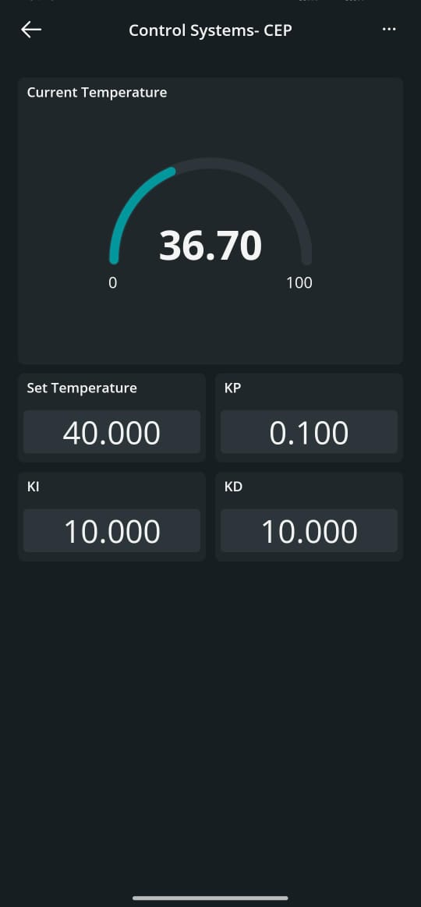

# 🔧 PID Temperature Control System with ESP32 and Arduino Cloud

This project implements a real-time PID controller on an ESP32 to maintain a desired temperature using a DHT22 sensor. A fan and bulb are controlled via PWM to regulate heating and cooling, while the system can be monitored and adjusted through an Arduino Cloud-based Android app.

## 📱 Features
- PID controller developed from scratch
- Real-time temperature control with DHT22
- Fan & bulb control based on error correction
- WiFi connectivity for cloud integration
- Android app for setpoint and gain tuning

## 🎥 Demo Video

Watch the system in action on YouTube:  
👉 [**PID Temperature Control Demo**]([[https://www.youtube.com/watch?v=YOUR_VIDEO_ID](https://youtu.be/CZXyboN238I)](https://youtu.be/CZXyboN238I))

## 🖼️ System Views

**Top View**  

**Bottom View**  

**Android App Interface**  

## 🛠️ Hardware Used
- ESP32 Dev Board  
- DHT22 Temperature Sensor  
- DC Motor (Fan)  
- Bulb (Simulated Heating Element)  
- MOSFET Driver Circuit  
- Arduino Cloud & Mobile App  

